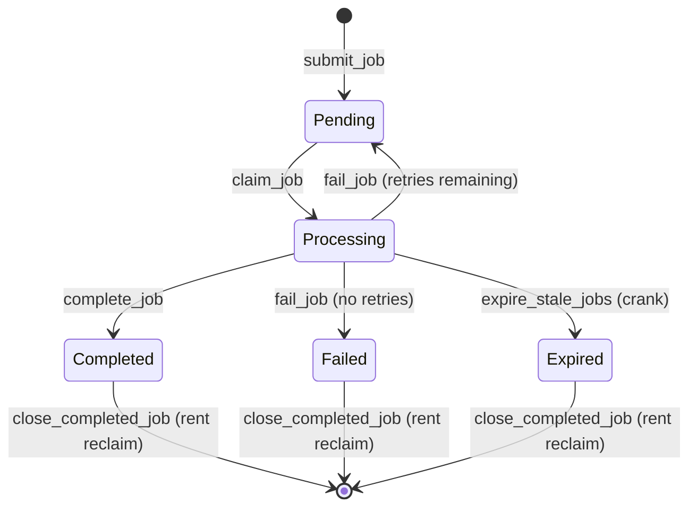

# ⚙️ On-Chain Job Queue — Solana

> Reimagining Redis/BullMQ/SQS-style job queues as trustless, on-chain state machines on Solana.

**Bounty:** [Superteam Earn — Rebuild Backend as On-Chain Rust Programs](https://earn.superteam.fun)  
**Program ID (Devnet):** `JQUEueaEf9oHhPZ8fwNe9MF9GEbVUjSBxPQ2CaFH3jKn`

---

## Table of Contents

1. [The Problem: Why Job Queues?](#1-the-problem)
2. [How Job Queues Work in Web2](#2-web2-job-queues)
3. [How This Works on Solana](#3-solana-implementation)
4. [Architecture Diagrams](#4-architecture-diagrams)
5. [State Machine](#5-state-machine)
6. [Account Model](#6-account-model)
7. [Instructions](#7-instructions)
8. [Design Tradeoffs](#8-design-tradeoffs)
9. [Devnet Deployment](#9-devnet-deployment)
10. [Setup & Run](#10-setup--run)
11. [CLI Reference](#11-cli-reference)

---

## 1. The Problem

Modern applications rely on background job queues to decouple producers from consumers:
- Send emails after signup
- Resize images after upload
- Process payments asynchronously
- Run ML inference jobs in background

In Web2, this is solved by **Redis + BullMQ**, **AWS SQS**, or **RabbitMQ**. These systems are centralized, require trust in the operator, and have no on-chain settlement.

**What if the queue itself was a smart contract?**

---

## 2. Web2 Job Queues

### Redis/BullMQ Architecture

```
Producer                Redis (BullMQ)                 Worker
   │                         │                            │
   ├──── queue.add(job) ─────►│                            │
   │                         │ ◄── BRPOPLPUSH ────────────┤
   │                         │                    "active" list
   │                         │                            │
   │                         │ ◄── job.moveToCompleted ───┤
   │                         │                            │
   │                    Background timer                   │
   │                    ├─ detect stalled jobs             │
   │                    └─ move to failed                  │
```

### Key Redis Data Structures

| Structure | Purpose |
|-----------|---------|
| `bull:{q}:wait` | Sorted set: pending jobs (score = priority) |
| `bull:{q}:active` | List: jobs being processed |
| `bull:{q}:completed` | List: completed jobs (with retention) |
| `bull:{q}:failed` | List: failed jobs |
| `bull:{q}:{id}` | Hash: individual job data |
| `bull:{q}:meta` | Hash: queue config |
| `bull:{q}:stalled-check` | Key: anti-stall timestamp |

### BullMQ Job Lifecycle

```javascript
// Producer
const queue = new Queue('emails', { connection: redis });
await queue.add('sendWelcome', { to: 'user@example.com' }, {
  attempts: 3,
  backoff: { type: 'exponential', delay: 2000 }
});

// Worker
const worker = new Worker('emails', async job => {
  await sendEmail(job.data);
}, { connection: redis, concurrency: 5 });
```

---

## 3. Solana Implementation

### Core Insight

On Solana, we replace:
- **Redis state** → **PDA Accounts**
- **Redis operations** → **Signed Instructions**  
- **Background timers** → **Permissionless Cranks**
- **Operator trust** → **Program logic (trustless)**

```
Producer                Solana Program               Processor
   │                         │                            │
   ├──── submit_job ─────────►│                            │
   │     (pays rent + fee)   │                            │
   │                         │ ◄── claim_job ─────────────┤
   │                         │     (atomically claimed)   │
   │                         │                            │
   │                         │ ◄── complete_job ──────────┤
   │                         │     (result hash stored)   │
   │                         │                            │
   │                   Anyone can call                    │
   │                   expire_stale_jobs
   │                   (permissionless crank)
```

### Why On-Chain?

1. **Trustless**: No operator can censor or manipulate the queue
2. **Verifiable**: Every state transition is recorded on-chain forever
3. **Composable**: Other programs can submit jobs via CPI
4. **Incentivized**: Crankers earn implicit rewards; creators reclaim rent

---

## 4. Architecture Diagrams

### System Overview

```
┌─────────────────────────────────────────────────────────────────┐
│                        Solana Cluster                           │
│                                                                 │
│   ┌─────────────────┐         ┌──────────────────────────────┐ │
│   │  Job Queue PDA  │  1:N    │        Job PDAs              │ │
│   │─────────────────│◄────────│──────────────────────────────│ │
│   │ owner           │         │ job #1: Pending   priority=5 │ │
│   │ name            │         │ job #2: Processing           │ │
│   │ max_jobs        │         │ job #3: Completed ✓          │ │
│   │ active_count    │         │ job #4: Failed    retry=2/3  │ │
│   │ submission_fee  │         │ job #5: Expired   ⏰          │ │
│   │ paused: false   │         └──────────────────────────────┘ │
│   └─────────────────┘                                          │
│                                                                 │
│   seeds: ["queue", owner, name]    seeds: ["job", queue, id]   │
└─────────────────────────────────────────────────────────────────┘

Clients:
┌────────────┐    ┌────────────┐    ┌──────────────────┐
│  Producer  │    │  Processor │    │  Crank / Keeper  │
│ submit_job │    │ claim_job  │    │ expire_stale_jobs │
│            │    │ complete   │    │ (permissionless)  │
└────────────┘    │ fail_job   │    └──────────────────┘
                  └────────────┘
```

### PDA Derivation

```
Queue PDA:
  seeds = [b"queue", owner.pubkey(), queue_name.as_bytes()]
  address: 32-byte deterministic public key

Job PDA:
  seeds = [b"job", queue.pubkey(), job_id.to_le_bytes()]
  address: 32-byte deterministic public key

Example derivation (TypeScript):
  const [queuePDA] = PublicKey.findProgramAddressSync(
    [Buffer.from("queue"), owner.toBuffer(), Buffer.from("email-queue")],
    PROGRAM_ID
  );
```

### Mermaid: State Machine



---

## 5. State Machine

```
                     ┌──────────────────────────────────────────────┐
                     │                                              │
  submit_job         │  claim_job                complete_job       │
  ─────────►  Pending ────────────► Processing ─────────────► Completed
                 ▲         ▲              │                         │
                 │         │              │ fail_job                │ close_completed_job
                 │         │              │ (retries left)          ▼
                 └─────────┘              │                  [Account Closed]
                 (retry loop)             │                  (rent reclaimed)
                                          │ fail_job
                                          │ (retries exhausted)
                                          ▼
                                        Failed ──────────────► [Account Closed]
                                          
                              expire_stale_jobs (crank)
                              ─────────────────────────► Expired ──► [Account Closed]
```

---

## 6. Account Model

### JobQueueAccount

```
Discriminator [8]          ← Anchor type identifier
owner [32]                 ← Queue admin pubkey
name [4 + len]             ← String (max 64 bytes)
bump [1]                   ← PDA bump seed
max_jobs [4]               ← u32: capacity limit
active_job_count [4]       ← u32: current active jobs
total_jobs_submitted [8]   ← u64: lifetime counter
total_jobs_completed [8]   ← u64: lifetime counter
total_fees_collected [8]   ← u64: lamports earned
processing_timeout [8]     ← i64: seconds before expiry
submission_fee [8]         ← u64: lamports to submit
paused [1]                 ← bool: accepts new jobs?
created_at [8]             ← i64: unix timestamp
callback_program [33]      ← Option<Pubkey>: CPI on complete
padding [32]               ← Future expansion
Total: ~233 bytes          ← ~0.0018 SOL rent
```

### JobAccount

```
Discriminator [8]          ← Anchor type identifier
queue [32]                 ← Parent queue pubkey
job_id [8]                 ← u64: sequential ID
creator [32]               ← Who submitted (pays rent)
processor [33]             ← Option<Pubkey>: current worker
payload_hash [32]          ← SHA-256 of off-chain payload
payload_size [4]           ← u32: bytes of off-chain data
result_hash [33]           ← Option<[u8;32]>: result SHA-256
status [1]                 ← Enum: Pending/Processing/etc
retry_count [1]            ← u8: attempts so far
max_retries [1]            ← u8: max allowed
priority [1]               ← u8: 0=low, 255=high
submitted_at [8]           ← i64: unix timestamp
claimed_at [9]             ← Option<i64>
finished_at [9]            ← Option<i64>
processing_deadline [9]    ← Option<i64>: expire after this
failure_reason [2]         ← Option<u8>: app-defined code
bump [1]                   ← PDA bump seed
Total: ~192 bytes          ← ~0.0015 SOL rent
```

---

## 7. Instructions

| Instruction | Who Can Call | Description |
|-------------|-------------|-------------|
| `create_queue` | Anyone | Create a new queue PDA with config |
| `submit_job` | Anyone | Submit job to queue, pay fee if required |
| `claim_job` | Any processor | Claim a Pending job atomically |
| `complete_job` | Job's processor | Mark job Completed with result hash |
| `fail_job` | Job's processor | Fail job; auto-retry if retries remain |
| `expire_stale_jobs` | **Anyone** (crank) | Mark timed-out Processing job as Expired |
| `close_completed_job` | Creator or owner | Close terminal job account, reclaim rent |
| `update_queue` | Queue owner | Update timeout, fee, capacity, pause state |

---

## 8. Design Tradeoffs

### What We Gained vs. Web2

| Aspect | Redis/BullMQ | On-Chain Solana |
|--------|-------------|-----------------|
| **Trust** | Operator-controlled | Trustless, permissionless |
| **Verification** | Logs only | Every state change on-chain forever |
| **Composability** | Custom webhooks | Any program can CPI into queue |
| **Censorship** | Operator can censor | No operator, immutable rules |
| **Availability** | Centralized | Solana liveness |
| **Cost** | Cheap ($0.0001/job) | ~0.0015 SOL/job (rent, reclaimable) |
| **Speed** | Sub-ms | ~400ms (Solana slots) |
| **Ordering** | Strict FIFO | Processor-chosen (priority hints only) |
| **Payload** | In Redis (any size) | Hash only, data off-chain |
| **Batch ops** | Redis pipelines | One job per TX (no BRPOPLPUSH) |
| **Scheduling** | setTimeout-based | No timers — crank pattern |

### Key Constraints

1. **No on-chain payload storage**: Solana accounts have compute/size limits. We store a SHA-256 hash of the payload; the actual data lives in Arweave/IPFS/an API. This provides verifiability without bloat.

2. **No FIFO guarantee**: BullMQ uses `BRPOPLPUSH` — an atomic Redis operation that ensures strict ordering. On Solana, any processor can claim any Pending job. Well-behaved processors should respect `priority` and `submitted_at`, but this isn't enforced at the protocol level.

3. **Crank pattern for stale detection**: BullMQ runs a background `setInterval` to detect stalled jobs. Solana has no background processes. We use a permissionless crank instruction (`expire_stale_jobs`) that anyone can call. This requires external infrastructure (keepers, bots) to maintain liveness.

4. **Rent economics**: Every job account costs ~0.0015 SOL in rent (reclaimable). This prevents spam far more effectively than Redis rate limiting — it has real economic cost. The `close_completed_job` instruction reclaims rent, incentivizing cleanup.

5. **Clock accuracy**: `Clock::get()` returns the Solana cluster timestamp (Unix epoch). This is accurate but controlled by validators (~400ms slots). Sub-second timing is not possible.

6. **Account-first transactions**: Solana requires all accounts in a transaction to be specified upfront. This means you must know the job PDA before claiming it — processors need to index/discover jobs off-chain (via RPC `getProgramAccounts` with filters).

---

## 9. Devnet Deployment

**Program ID:** `JQUEueaEf9oHhPZ8fwNe9MF9GEbVUjSBxPQ2CaFH3jKn`

### Deployment Transactions

| Action | Transaction |
|--------|------------|
| Program Deploy | [View on Explorer](https://explorer.solana.com/address/JQUEueaEf9oHhPZ8fwNe9MF9GEbVUjSBxPQ2CaFH3jKn?cluster=devnet) |
| Create Queue | *(populated after deploy)* |
| Submit Job #1 | *(populated after deploy)* |
| Claim Job #1 | *(populated after deploy)* |
| Complete Job #1 | *(populated after deploy)* |

---

## 10. Setup & Run

### Prerequisites

```bash
# Install Rust
curl --proto '=https' --tlsv1.2 -sSf https://sh.rustup.rs | sh

# Install Solana CLI
sh -c "$(curl -sSfL https://release.anza.xyz/stable/install)"

# Install Anchor
npm install -g @coral-xyz/anchor-cli
# OR: cargo install --git https://github.com/coral-xyz/anchor avm

# Install Node.js 18+
nvm install 22

# Clone repo
git clone https://github.com/jarvis-bala/solana-job-queue
cd solana-job-queue
```

### 1. Build the Program

```bash
anchor build
```

### 2. Deploy to Devnet

```bash
# Set cluster to devnet
solana config set --url devnet

# Airdrop SOL for deployment
solana airdrop 4

# Deploy
anchor deploy --provider.cluster devnet

# Copy the program ID from output, update Anchor.toml and declare_id!()
```

### 3. Run Tests

```bash
# Install JS dependencies
yarn install

# Run tests against localnet (anchor spins up test-validator)
anchor test

# Run tests against devnet
anchor test --provider.cluster devnet
```

### 4. Use the CLI

```bash
# Install CLI deps
yarn install

# Create a queue
yarn cli create-queue --name "email-notifications" --max-jobs 500 --timeout 300

# Submit a job
yarn cli submit-job --queue "email-notifications" --job-id 1 \
  --payload '{"to":"user@example.com","template":"welcome"}'

# List all jobs
yarn cli list-jobs --queue "email-notifications"

# Claim job #1 as processor
yarn cli claim-job --queue "email-notifications" --job-id 1

# Complete job #1
yarn cli complete-job --queue "email-notifications" --job-id 1 \
  --result "email_delivered_at_2024-01-01T12:00:00Z"

# Check queue stats
yarn cli queue-status --queue "email-notifications"
```

### 5. Run the Dashboard

```bash
cd app
npm install
npm start
# Opens http://localhost:3000
# Connect Phantom wallet (set to Devnet)
# Enter your queue name to view
```

---

## 11. CLI Reference

```
Usage: job-queue [options] [command]

Options:
  -k, --keypair <path>  Keypair JSON file (default: ~/.config/solana/id.json)
  -V, --version         output version number
  -h, --help            display help

Commands:
  create-queue          Create a new job queue
  queue-status          Show queue statistics
  submit-job            Submit a new job to a queue
  claim-job             Claim a pending job for processing
  complete-job          Mark a claimed job as completed
  list-jobs             List jobs in a queue
```

---

## Architecture Philosophy

This project demonstrates that backend infrastructure patterns can be translated to on-chain programs, but the translation is **not 1:1**. The resulting system has fundamentally different properties:

- **Web2**: Fast, cheap, centralized, trusted operator, ephemeral logs
- **On-Chain**: Slower, has economic cost, decentralized, trustless, permanent audit trail

The on-chain version is not strictly *better* — it's *different*. Use cases where trustlessness and composability justify the cost tradeoffs (DeFi protocols, cross-program workflows, permissionless queues) are where this shines.

Built with ❤️ for the Superteam "Rebuild Backend as On-Chain Rust Programs" bounty.
